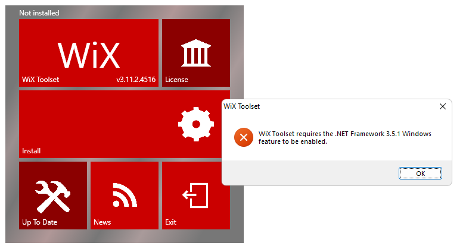
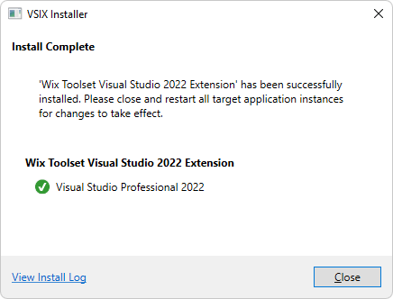

# WiX Burn Bundle to deploy the WebView2 Runtime

This sample, **WV2DeploymentWiXBurnBundleSample**, demonstrates how to use a WiX Burn Bundle to deploy the WebView2 Runtime.  Do the steps in this article to create a WiX installer that chain-installs the Evergreen WebView2 Runtime through Burn Bundle.

*  Sample name: **WV2DeploymentWiXBurnBundleSample**
*  Repo directory: [WV2DeploymentWiXBurnBundleSample](https://github.com/MicrosoftEdge/WebView2Samples/tree/main/SampleApps/WV2DeploymentWiXBurnBundleSample)
*  Project file: **WV2DeploymentWiXBurnBundleSample.wixproj**

This sample creates a [WiX](https://wixtoolset.org/) installer for the [Win32 sample app (WebView2APISample)](webview2apissample.md).  This sample uses [WiX Burn Bundle](https://wixtoolset.org/documentation/manual/v3/bundle/) to chain-install the Evergreen WebView2 Runtime.

<!-- todo: screenshot representing the success state -->

This sample demonstrates these two different distribution approaches to distribute the WebView2 Runtime for your app:
*  Downloading the Evergreen WebView2 Runtime Bootstrapper through a link stored in your app.
*  Packaging the Evergreen WebView2 Runtime Bootstrapper with your app.

The other approach, not demonstrated in this sample, is packaging the Evergreen WebView2 Runtime Standalone Installer with your app.  That approach is very similar to packaging the Evergreen WebView2 Runtime Bootstrapper with your app.

For an overview of the approaches, see [Deploying the Evergreen WebView2 Runtime](../concepts/distribution.md#deploying-the-evergreen-webview2-runtime) in _Distribute your app and the WebView2 Runtime_.

<!-- ====================================================================== -->
## Step 1 - Prerequisite: Install Visual Studio

Microsoft Visual Studio is required.  Microsoft Visual Studio Code is not supported for this sample.

If Visual Studio (minimum required version) is not already installed, with C++ support:

1. In a separate window or tab, see [Install Visual Studio](../how-to/machine-setup.md#install-visual-studio) in _Set up your Dev environment for WebView2_.  Follow the steps in that section to install Visual Studio, including C++ support.

Then return to this page and continue the steps below.

<!-- ====================================================================== -->
## Step 2 - Prerequisite: Install WiX Toolset build tools

<!-- todo: how to make "Unsupported" go away?  what to say about it?
If you haven't installed WiX tools, the WiX deployment projects in Solution Explorer are marked as "Unsupported":

 -->

<!-- Installing WiX is covered in [WiX Burn Bundle to deploy the WebView2 Runtime](./wv2deploymentwixburnbundlesample.md) but it's a good idea to install them for this **WebView2APISample** solution so it's a complete coherent setup.  So, install them, as follows: -->

1. In a new window or tab, go to [WiX Toolset](https://wixtoolset.org/releases/) and then download the **WiX Toolset build tools**.

   <!-- finding: this would just be an extra, roundabout step: Or, in Visual Studio, select **Extensions > Manage Extensions**.  The **Manage Extensions** dialog opens.  In the **Search** box, enter **wix toolset**, click the **WiX Toolset Build Tools** card, and then click the **Download** button to open the above webpage:   -->

1. Click the `wixnnn.exe` file, and then click **Open file**.

   A dialog might open, **Requires .NET Framework 3.5.1 to be enabled**:

   

   If .NET Framework 3.5.1 is already enabled on your machine, skip ahead to continue installing this WiX component.

1. Click the **OK** button.  The WiX installer window closes.

1. Press the **Windows** key  on your keyboard, type **Windows Features**, and then press **Enter**.  The **Turn Windows features on or off** dialog box appears.

1. Select the **.NET Framework 3.5 (includes .NET 2.0 and 3.0)** check box:

   

   You don't need to select the child items.

1. Click **OK**.  You might be prompted whether to let Windows Update download files.

   For more information, see [Install the .NET Framework 3.5 on Windows 11, Windows 10, Windows 8.1, and Windows 8](/dotnet/framework/install/dotnet-35-windows).

1. After .NET Framework 3.5.1 is enabled, again run the `wixnnn.exe` file.  For example, in Microsoft Edge, click **Settings and more**, click **Downloads**, and then click **Open file** below `wix311.exe`.

1. Click the **Install** panel of the WiX installer.

1. In **User Account Control**, click the **Yes** button.  The top of the WiX installer reads "Successfully installed".

Also install the WiX Visual Studio component, per the next section.

<!-- ====================================================================== -->
## Step 3 - Prerequisite: Install WiX Toolset Visual Studio Extension

1. In a new window or tab, go to [WiX Toolset](https://wixtoolset.org/releases/) and then download and install the appropriate extension:
   * WiX Toolset Visual Studio 2022 Extension - downloaded installer file: `Votive2022.vsix` 
   * WiX Toolset Visual Studio 2019 Extension - downloaded installer file: `Votive2019.vsix`

1. In **User Account Control**, click the **Yes** button.  VSIX Installer for WiX Visual Studio extension opens:

   <!--  -->

   

1. Click the **Install** button.  A **VSIX waiting for processes to shut down** dialog might open:

   

1. Close Visual Studio.  The VSIX Installer proceeds.  The VSIX Installer reads **Install complete**:

   <!--  -->

   

1. In VSIX Installer, click the **Close** button.

1. In the WiX installer, click the **Exit** panel.

<!-- ====================================================================== -->
## Step 4 - Clone or download the WebView2Samples repo

1. If not done already, clone or download the `WebView2Sample` repo to your local drive.  In a separate window or tab, see [Download the WebView2Samples repo](../how-to/machine-setup.md#download-the-webview2samples-repo) in _Set up your Dev environment for WebView2_.

Follow the steps in that section, and then return to this page and continue below.

<!-- ====================================================================== -->
## Step 5 - Build the deployment project

1. In your local copy of the WebView2Samples repo, open `<repo-location>\WebView2Samples\SampleApps\WebView2Samples.sln` with Visual Studio (not Visual Studio Code).

   If the **Unsupported ... .wixproj** dialog box appears, install the WiX Toolset and the WiX Toolset Extension, above:

   

1. This sample is an extension to the [WV2DeploymentWiXCustomActionSample](./wv2deploymentwixcustomactionsample.md) sample.  In Solution Explorer, expand **WV2DeploymentWiXCustomActionSample** and then double-click `Product.wxs`.

1. In `Product.wxs`, comment out all the `<Binary>`, `<CustomAction>`, and `<Custom>` elements under `<!-- Step 4: Config Custom Action to download/install Bootstrapper -->` and `<!-- Step 5: Config execute sequence of custom action -->` so that Custom Action is not used.

1. Open `Bundle.wxs` under the `WV2DeploymentWiXBurnBundleSample` project.  Edit `Bundle.wxs` depending on which workflow you want to use:

   **To package the Evergreen WebView2 Runtime Bootstrapper with your app:**
   *  Uncomment the `<ExePackage Id="InvokeBootstrapper" ...>` element below `<!-- [Package Bootstrapper] ... -->`, and comment out other `<ExePackage>` elements.

   **To download the Evergreen WebView2 Runtime Bootstrapper through a link in your app:**
   *  Uncomment the `<ExePackage Id="DownloadAndInvokeBootstrapper" ...>` element below `<!-- [Download Bootstrapper] ... -->`, and comment out other `<ExePackage>` elements.

1. If you are packaging the Evergreen WebView2 Runtime Bootstrapper with your app, [download](https://developer.microsoft.com/microsoft-edge/webview2/) the Bootstrapper and place it under the enclosing `SampleApps` folder.

1. Build the `WV2DeploymentWiXBurnBundleSample` project.

<!-- TODO: describe the Done state; explain result: accomplished xyz.  you'll use this result to... distribute runtime with app.

## Next steps
-->

<!-- ====================================================================== -->
## See also

* [Deploying the Evergreen WebView2 Runtime](../concepts/distribution.md#deploying-the-evergreen-webview2-runtime) in _Distribute your app and the WebView2 Runtime_.
